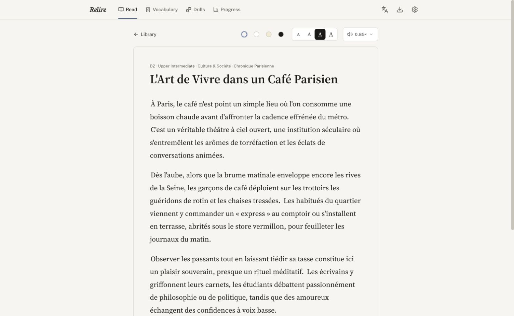
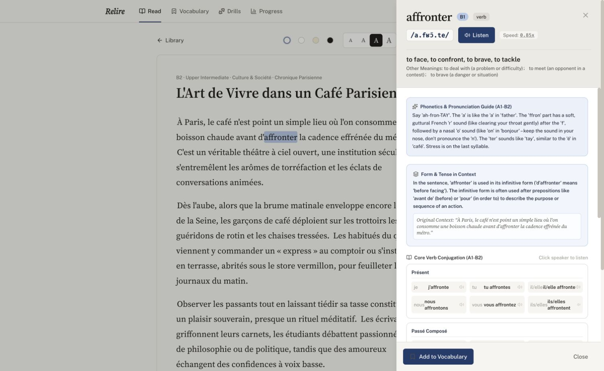
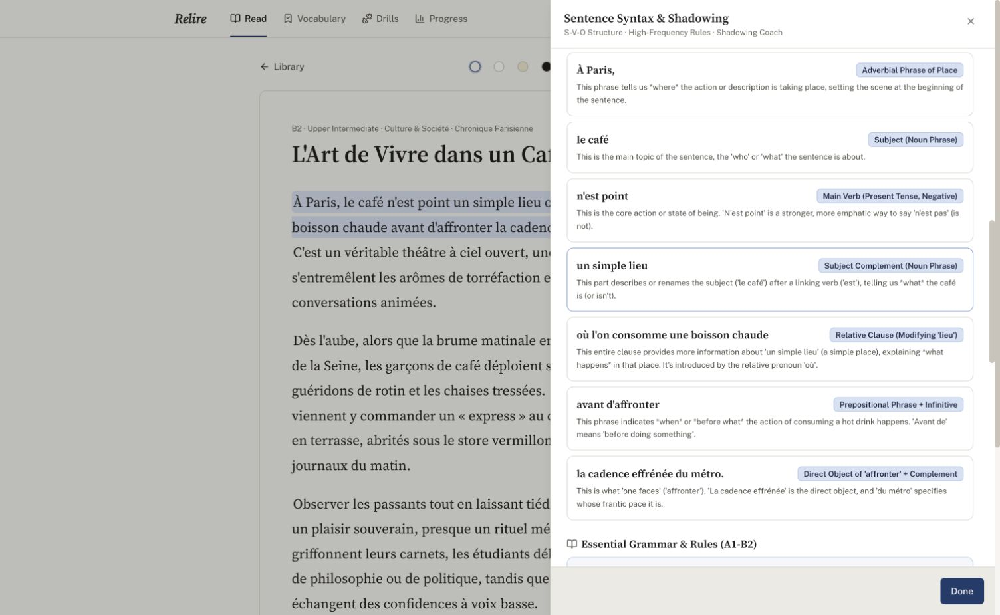
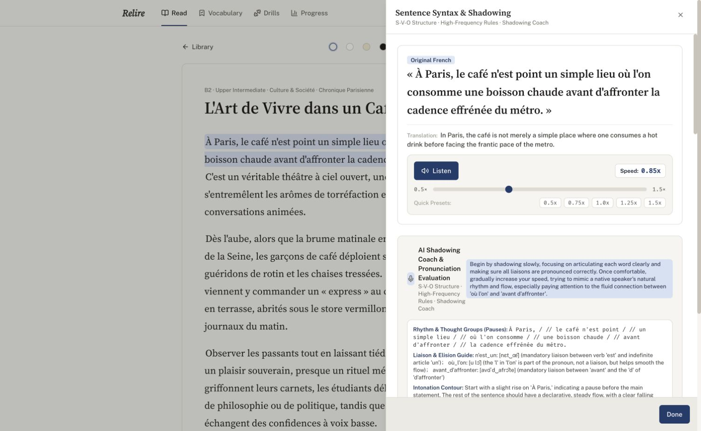

# Relire — French Reading & Pronunciation Trainer

**Open-source French close-reading, shadowing and pronunciation practice for TCF Canada.**

[Try Relire online](https://royisme.github.io/relire/) · **English** · [简体中文](README.zh-CN.md)

Read real French → tap a word or sentence → understand it in context → shadow the sentence → get AI pronunciation feedback.

Relire runs entirely in your browser. There is no application server and no account. Bring your own Gemini API key, keep your learning data on your device, and install it as a PWA on desktop or mobile.

**Why Relire**

- Context-aware word explanations with IPA, verb tense and conjugation.
- Sentence translation, grammar breakdown, collocations and shadowing guidance.
- Pronunciation feedback on sounds, liaisons and intonation.
- Spaced-repetition vocabulary review with SM-2.
- Local-first storage and cached audio/AI results.
- English and Simplified Chinese interfaces.

> Relire focuses on reading and pronunciation practice. It is not a TCF mock-exam platform, its AI scores are estimates rather than official results, and it is not affiliated with France Éducation international or IRCC.

## A look inside

Read a French article with adjustable text size and playback speed.



Tap a word to see its meaning in context, IPA, pronunciation guidance and verb conjugations beside the article.



Break down a sentence into grammatical parts while keeping the original text in view.



<details>
<summary>Article library and shadowing guide</summary>

Search and filter articles by CEFR level.


Follow the sentence translation and shadowing guide, and adjust playback speed as you practise.



</details>

## What you can do

- **Keep a library of articles.** Three B1 to C1 samples are included. Paste your own, then search, filter by level, sort, edit or delete them from a simple list. Choose text size and theme, and slow the audio down to 0.5×.
- **Tap any word.** You get the lemma, meaning in context, IPA, the verb tense, a conjugation table and example sentences. Save it to your vocabulary in one click.
- **Break down a hard sentence.** Translation, syntax segments, grammar points, common collocations and a shadowing guide (rhythm groups, liaisons, intonation).
- **Shadow and get feedback.** Record yourself reading a sentence and receive an overall score, plus feedback on individual sounds, liaisons and intonation.
- **Look up any French sound.** A chart of the sounds of French in IPA, each with an example word you can tap to hear.
- **Review vocabulary with spaced repetition.** An SM-2 schedule decides what is due today.
- **Drill from the article you are reading.** Sentence scramble, oral shadowing and grammar cloze, generated from the current text.
- **Choose your AI.** The AI that writes explanations and the AI that reads aloud are separate settings, each with its own provider, model and key, and the code is built so more providers can be added.
- **Edit the prompts.** The instructions sent to the AI are plain-text templates you can view, change and reset in Settings.
- **Use it in English or Chinese.** The interface and the explanations switch between the two.

## Try it online

Open **https://royisme.github.io/relire/**. You can browse the included sample articles immediately. AI analysis, speech generation and pronunciation feedback require your own Gemini API key.

## Quick start

You need [Bun](https://bun.sh) and a free [Gemini API key](https://aistudio.google.com/apikey).

```bash
git clone https://github.com/royisme/relire.git
cd relire
bun install
bun run dev        # http://localhost:5173
```

On first launch a short guide helps you create and check your key. You can also add it later in **Settings**. Word and sentence analysis, audio and pronunciation feedback all need it.

### Run it as an installed app

```bash
bun run build      # static files in dist/
bun run preview    # serve them locally
```

`dist/` is a plain static site, so you can also host it anywhere (GitHub Pages, Netlify, an S3 bucket). Open it in Chrome, Edge or Safari and use the browser's install option; it then opens in its own window. Installing needs `localhost` or HTTPS.

Reading, your saved words and vocabulary review work offline. Anything that calls Gemini needs a connection.

### Privacy

Your articles, vocabulary and stats are stored in this browser's IndexedDB, and your API key and settings in its local storage. You can export and restore a backup from Settings (backups never include the key). Browsers can clear site data when space runs low or after long inactivity, particularly Safari for sites that are not installed, so install the app, use **Protect my data** in Settings, and export a backup now and then. When you use an AI feature, the word, sentence or recording is sent from your browser straight to Google's Gemini API using your key. Nothing goes through any other server. Generated explanations, drills and pronunciation audio are cached on your device. Reusing a cached result or audio clip needs no further API call, and cached audio works offline. Word analyses have no expiry; sentence analyses and drills expire after 30 days. Audio for saved vocabulary is protected from automatic cleanup; other clips may be removed when the audio store exceeds 200 MB. Settings shows what is saved and can clear it, and a backup can optionally include your vocabulary's audio. Anyone with access to your browser profile can read the stored key, so use a key you can revoke.

## How it is built

React 19, Vite, Tailwind CSS 4, i18next, and AI providers called directly from the browser (Gemini through `@google/genai`). `PRODUCT.md` describes who it is for and the principles behind it, `DESIGN.md` is the visual system, `docs/architecture.md` is a map of the code, and `CLAUDE.md` plus `.claude/` hold the guidance for AI coding agents.

```
src/services/ai/         providers, prompt templates and tasks; the UI calls src/services/api.ts
src/App.tsx              app state and screen navigation
src/storage/             IndexedDB persistence, answer cache and audio storage
src/components/          one file per screen or overlay
src/utils/srs.ts         SM-2 scheduling
```

`bun run lint` runs the TypeScript check. There are no automated tests yet.

## Contributing

Issues and pull requests are welcome. Please read `PRODUCT.md` and `DESIGN.md` before changing the UI, and keep every user-facing string in both `src/i18n/locales/en.json` and `zh.json`.

## License

[MIT](LICENSE)
