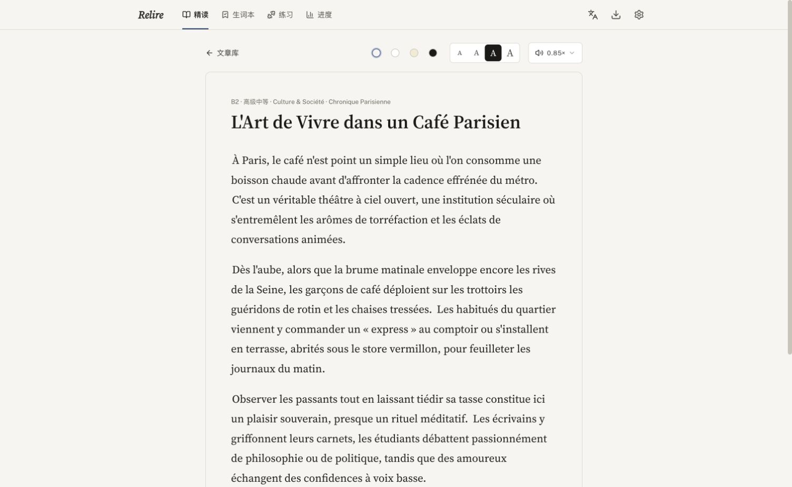
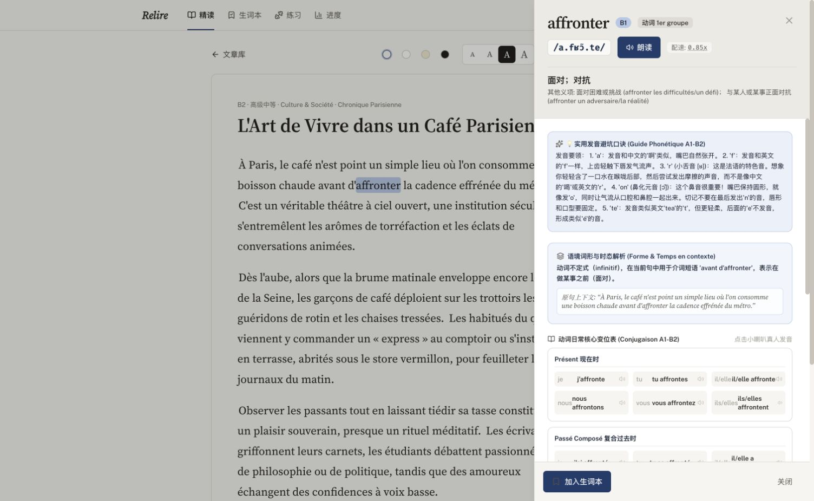
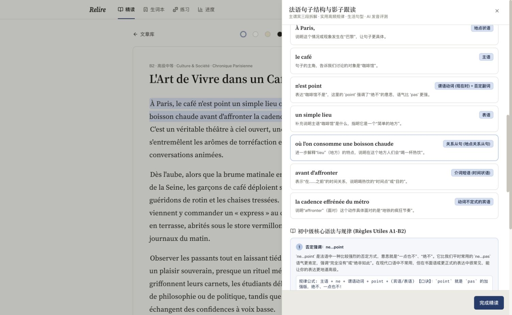
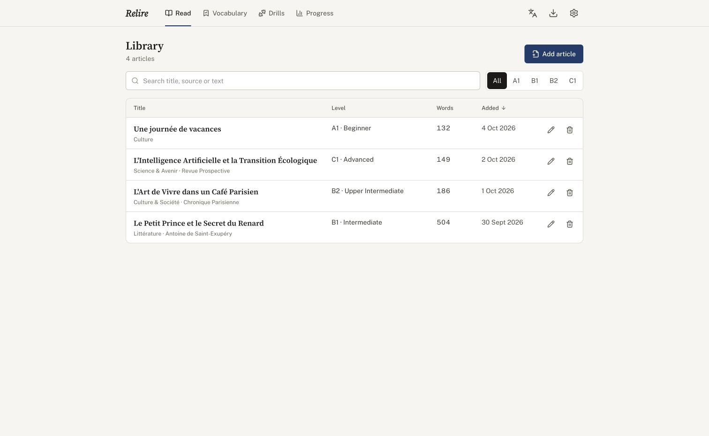

# Relire — 法语精读与发音训练

**面向 TCF Canada 学习者的开源法语精读、影子跟读与发音训练工具。**

[在线体验 Relire](https://royisme.github.io/relire/) · [English](README.md) · **简体中文**

读真实法语文章 → 点单词或句子 → 理解语境和语法 → 跟读 → 获得 AI 发音反馈。

Relire 完全在浏览器中运行，没有应用服务器，也不用注册账号。你自带 Gemini API Key，学习数据保存在本机，还可以把它安装成电脑或手机上的 PWA。

**为什么用 Relire**

- 单词语境释义、IPA、时态和动词变位。
- 句子翻译、语法拆解、常见搭配和跟读指导。
- 针对音素、联诵和语调的发音反馈。
- 基于 SM-2 的间隔重复生词复习。
- 本地优先存储，并缓存音频和 AI 结果。
- 支持英文和简体中文界面。

> Relire 专注阅读和发音训练，不是 TCF 模考平台。AI 打分只是估计值，不是官方成绩；项目与 France Éducation international、IRCC 没有任何关联。

## 界面预览

阅读法语文章，按自己的习惯调整字号和朗读速度。



点击单词，在原文旁查看中文释义、音标、发音提示和动词变位。



逐段拆解难句，结合中文讲解理解语法和句子结构。



<details>
<summary>查看文章库</summary>

搜索文章，按 CEFR 等级筛选。



</details>

## 能做什么

- **管理自己的文章库。** 内置三篇 B1 到 C1 的示例，也可以粘贴自己的文章，并在列表里搜索、按等级筛选、排序、编辑和删除。字号和主题可调，朗读速度最低可到 0.5 倍。
- **点任何一个单词。** 查看词元、语境中的释义、国际音标（IPA）、动词时态、变位表和例句，一键加入生词本。
- **拆解难句。** 译文、句法成分、语法点、常见搭配，以及影子跟读指南（节奏群、联诵、语调）。
- **跟读并获得反馈。** 录下自己读句子的声音，得到总分，以及单个音素、联诵和语调的反馈。
- **随时查法语发音。** 用国际音标列出法语的全部发音，每个音配一个示例单词，点一下就能听。
- **用间隔重复复习生词。** 按 SM-2 算法安排今天该复习的词。
- **从当前文章生成练习。** 句子重组、口语跟读、语法填空。
- **自选 AI。** 负责讲解的 AI 和负责朗读的 AI 是两项独立设置，各有各的提供方、模型和 Key，代码也预留了接入更多提供方的方式。
- **编辑提示词。** 发给 AI 的指令是纯文本模板，可以在设置里查看、修改和恢复默认。
- **中英文界面。** 界面和讲解可以在中文和英文之间切换。

## 在线体验

打开 **https://royisme.github.io/relire/** 即可浏览内置示例文章。AI 解析、语音生成和发音反馈需要使用你自己的 Gemini API Key。

## 快速开始

需要 [Bun](https://bun.sh) 和一个免费的 [Gemini API Key](https://aistudio.google.com/apikey)。

```bash
git clone https://github.com/royisme/relire.git
cd relire
bun install
bun run dev        # http://localhost:5173
```

第一次打开时会有一个简短的引导，帮你创建并检查 Key，之后也可以在**设置**里添加。单词和句子解析、朗读音频、发音反馈都要用到它。

### 作为应用安装

```bash
bun run build      # 静态文件输出到 dist/
bun run preview    # 在本地预览
```

`dist/` 就是普通的静态网站，也可以放到任何地方（GitHub Pages、Netlify、S3 等）。用 Chrome、Edge 或 Safari 打开后，选择浏览器的“安装”选项，它就会在独立窗口里运行。安装需要 `localhost` 或 HTTPS。

阅读、已保存的生词和生词复习可以离线使用。凡是要调用 Gemini 的功能都需要联网。

### 隐私

文章、生词和统计数据保存在这个浏览器的 IndexedDB 里，API Key 和设置保存在本地存储里。可以在设置中导出和恢复备份（备份文件不包含 Key）。浏览器在空间不足或长期不使用时可能清掉网站数据，Safari 对没有安装的网站尤其如此，所以请安装成应用、在设置里点“保护我的数据”，并定期导出备份。使用 AI 功能时，单词、句子或录音会用你的 Key 从浏览器直接发给 Google 的 Gemini API，不经过任何其他服务器。生成的解析、练习题和发音音频会缓存在你的设备上。复用已缓存的结果或音频无需再次调用 API，已缓存的音频也可以离线播放。单词解析没有过期时间，句子解析和练习题在 30 天后过期。生词本关联的音频不会被自动清理；音频总量超过 200 MB 时，其他音频可能被清理。可以在设置里查看和清除，备份时也可以选择带上生词本的音频。能访问你浏览器配置的人可以读到保存的 Key，所以请使用可以随时撤销的 Key。

## 技术栈

React 19、Vite、Tailwind CSS 4、i18next，以及在浏览器里直接调用的 AI 提供方（Gemini 通过 `@google/genai`）。`PRODUCT.md` 说明产品面向谁以及设计原则，`DESIGN.md` 是视觉规范，`CLAUDE.md` 是给贡献者的代码地图。

```
src/services/ai/         提供方、提示词模板和任务；界面调用 src/services/api.ts
src/App.tsx              应用状态与页面切换
src/storage/             IndexedDB 持久化、解析缓存和音频存储
src/components/          每个页面或浮层一个文件
src/utils/srs.ts         SM-2 调度
```

`bun run lint` 运行 TypeScript 检查。目前还没有自动化测试。

## 参与贡献

欢迎提 issue 和 PR。修改界面前请先阅读 `PRODUCT.md` 和 `DESIGN.md`，所有面向用户的文案都要同时写进 `src/i18n/locales/en.json` 和 `zh.json`。

## 许可证

[MIT](LICENSE)
